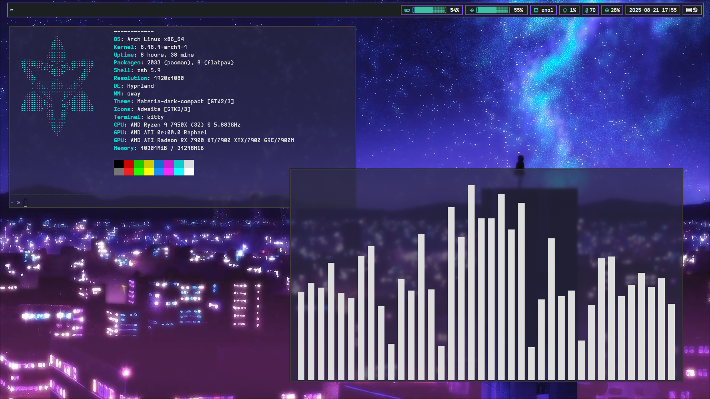

# My dotfiles

These are my dotfiles for my Hyprland setup.

## Preview



## Dependencies

- Hyprland
- mpd (media player daemon)
- ncmpcpp (media library TUI)
- swaync (notification panel)
- waybar (status bar)
- hyprpaper (wallpaper manager)
- kitty (terminal)
- thunar (file manager)
- wofi (run menu)
- fcitx (for JP or other alphabet writing)
- hyprpicker (color picker tool)
- grim + slurp
- wl-copy

```bash
yay -Sy waybar wofi waypaper
```

## Hyprland config notes

In [hyprland.conf](./hypr/hyprland.conf), `$terminal=kitty`, `$fileManager=thunar` and `$menu=wofi` can be swapped to your liking.

## Todo:
- Install script
- Add other pkgs confs
- Proper swaync config (or something else to replace it)
- do something about swaync it looks ugly
