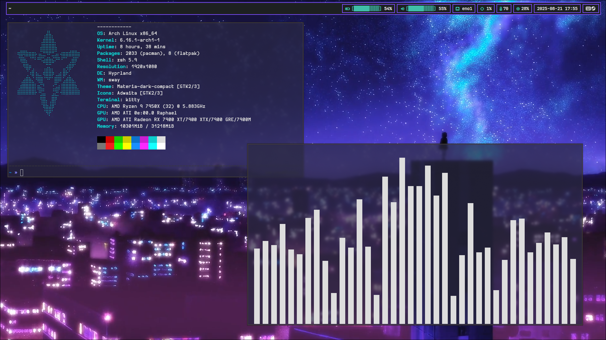

# My dotfiles

These are my dotfiles for my Hyprland setup.

## Preview

## Dependencies

### Core/System

- Hyprland (and its suite)

### UI/Style

- waybar (status bar)
- Dunst (notification panels)
- [awww](https://codeberg.org/LGFae/awww) (wallpaper backend)
- Hyprpaper (wallpaper selection UI)

### Tools

- mpd (media player daemon)
- ncmpcpp (media library TUI)
- kitty (terminal)
- thunar (file manager)
- Yazi (TUI file explorer)
- wofi (run menu)
- fcitx (for JP or other alphabet writing)
- hyprpicker (color picker tool)
- grim + slurp (for screenshots, check [screenshot](./screenshot)
- wl-copy (copy-paste)

## Hyprland config notes

In [hyprland.conf](./hypr/hyprland.conf), `$terminal=kitty`, `$fileManager=thunar` and `$menu=wofi` can be swapped to your liking.

## Todo:
- Install script
- Add other pkgs confs
